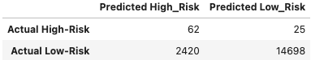

# Credit-Risk-Analysis
Using machine learning models to create a more accurate credit risk assessment

## Purpose
Credit risk is an inherently unbalanced classification problem, as good loans easily outnumber risky loans. Therefore, an accurate credit risk assessment will need to employ different resampling techniques to train and evaluate models with unbalanced classes. Using the credit card credit dataset from LendingClub, a peer-to-peer lending services company, I will evaluate the performance of these models and make a written recommendation on whether they should be used to predict credit risk.

## Results
Below describes the balanced accuracy scores, the precision, and recall scores of all six machine learning models:
#### 1. Naive Random Oversampling + Logistic Regression modeling

#### 2. SMOTE Oversampling + Logistic Regression modeling

#### 3. Undersampling + Logistic Regression modeling

#### 4. SMOTEENN Sampling + Logistic Regression modeling

#### 5. BalancedRandomForestClassifier

#### 6. EasyEnsembleClassifier

## Summary
All of the machine models produced low precision (how reliable the high risk classification is), but high recall/sensitivity (how many actual high risk loans were classifed as high risk). When evaluating credit risk it is more important to have higher sensitivity than precision; assuming that marketing cost per new customer is less than what is lost from a defaulted loan.

The Ensemble model was the most accurate. With only losing ~1 of every 16 loan opportunities due to a lack in precision, seems like a successful strategy of mitigating risk considering the high sensitivity. But without insight on how well the lending company is currently predicting credit risk it is impossible to reasonably recomend one of these machine models.  
